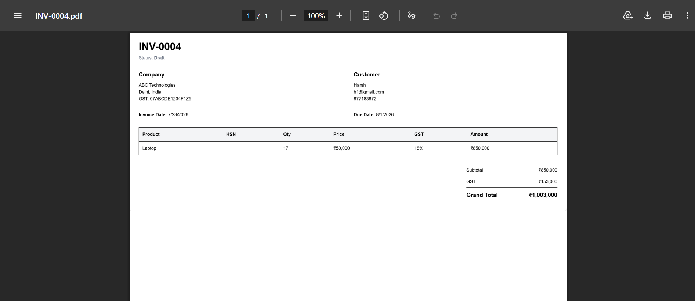

# 🚀 Enterprise Invoice Generator

A modern SaaS-based Invoice Management Platform built using the MERN Stack. The application enables businesses to efficiently manage companies, customers, products, invoices, and generate professional PDF invoices with secure authentication and an intuitive dashboard.

---

## 📸 Screenshots

> Add screenshots of the following pages after deployment.

- 🔐 Login Page

- 📊 Dashboard

- 👥 Customers

- 📦 Products

- 🧾 Invoices

- ➕ Create Invoice

- 📄 Generated PDF


---

# ✨ Features

### 🔐 Authentication
- JWT Authentication
- Secure Login & Registration
- Protected Routes

### 🏢 Company Management
- Create Company
- View Company Details
- Update Company Information

### 👥 Customer Management
- Add Customers
- Update Customer Details
- Delete Customers
- Search Customers

### 📦 Product Management
- Add Products
- GST & HSN Code Support
- Edit/Delete Products

### 🧾 Invoice Management
- Create Professional Invoices
- Dynamic Invoice Number Generation
- Search & Filter Invoices
- Change Invoice Status
- Delete Invoice
- View Invoice Details
- Download Invoice as PDF

### 📊 Dashboard
- Revenue Overview
- Total Customers
- Total Products
- Total Invoices
- Recent Invoices
- Color-Coded Invoice Status

### 🎨 User Interface
- Responsive Design
- Modern Dashboard
- Clean Navigation
- Color-coded Invoice Status
- Professional Invoice Preview

---

# 🛠 Tech Stack

## Frontend

- React.js
- TypeScript
- Vite
- Tailwind CSS
- Axios
- React Router DOM

## Backend

- Node.js
- Express.js
- TypeScript
- MongoDB Atlas
- Mongoose
- JWT Authentication
- bcryptjs

## PDF Generation

- PDFKit

---

# 📂 Folder Structure

```
enterprise-invoice-generator/

├── backend/
│   ├── controllers/
│   ├── middleware/
│   ├── models/
│   ├── routes/
│   ├── utils/
│   ├── config/
│   └── server.ts
│
├── frontend/
│   ├── src/
│   │   ├── components/
│   │   ├── pages/
│   │   ├── services/
│   │   ├── layouts/
│   │   └── App.tsx
│
└── README.md
```

---

# ⚙️ Installation

## Clone Repository

```bash
git clone https://github.com/Dhriti1209/Inv-gen.git

cd enterprise-invoice-generator
```

---

## Backend

```bash
cd backend

npm install

npm run dev
```

---

## Frontend

```bash
cd frontend

npm install

npm run dev
```

---

# 🔑 Environment Variables

Create a `.env` file inside the backend folder.

```env
PORT=5000

MONGO_URI=YOUR_MONGODB_ATLAS_URI

JWT_SECRET=YOUR_SECRET_KEY
```

---

# 📡 API Endpoints

## Authentication

```
POST /api/v1/auth/register

POST /api/v1/auth/login
```

---

## Company

```
POST /api/v1/company

GET /api/v1/company

PUT /api/v1/company/:id
```

---

## Customers

```
GET /api/v1/customers

POST /api/v1/customers

PUT /api/v1/customers/:id

DELETE /api/v1/customers/:id
```

---

## Products

```
GET /api/v1/products

POST /api/v1/products

PUT /api/v1/products/:id

DELETE /api/v1/products/:id
```

---

## Invoices

```
GET /api/v1/invoices

POST /api/v1/invoices

GET /api/v1/invoices/:id

PUT /api/v1/invoices/:id

PATCH /api/v1/invoices/:id/status

DELETE /api/v1/invoices/:id

GET /api/v1/invoices/:id/pdf
```

---

# 🚀 Future Enhancements

- Dashboard Charts
- Email Invoice to Customer
- Company Logo Upload
- Excel Export
- Pagination
- Dark Mode
- Payment Tracking
- Multi-Company Support
- Role-Based Access Control (RBAC)

---

# 📖 What I Learned

- Building a full-stack SaaS application using the MERN stack.
- Implementing secure JWT authentication.
- Designing scalable REST APIs with Express and TypeScript.
- Managing MongoDB relationships using Mongoose.
- Generating professional PDF invoices dynamically.
- Building responsive user interfaces with React and Tailwind CSS.
- Implementing search, filtering, and invoice status management.

---

# 🤝 Contributing

Contributions, issues, and feature requests are welcome!

Feel free to fork this repository and submit a pull request.

---

# 👩‍💻 Author

**Dhriti Joshi**

B.Tech CSE (AI & ML)

Manipal University Jaipur

---
